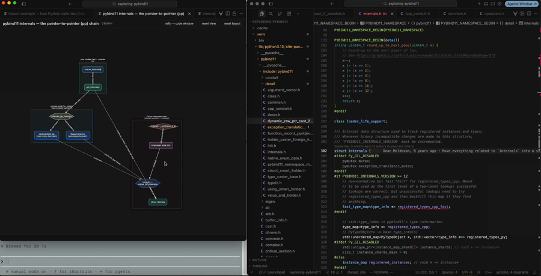

# Tired of badly formatted markdown? Give your LLM a canvas. 🎨

**jarbobo** lets Claude (or any MCP client) draw **real, interactive diagrams inside your editor** —
not ASCII art, not a mermaid string it hallucinated half the syntax for, not a PNG in another tab.

Graphs, UML sequence diagrams, and class diagrams that live in Cursor as first-class tabs, where
**every node is a live pointer into your code**: hover it for the gist, click it and your editor
jumps to the exact `file:line`.

[](assets/demo.mov)

*Above: exploring pybind11's internals — **click the image to watch the full demo** (0:14).
The diagram was drawn by Claude via MCP; clicking `struct internals` focuses `internals.h:302`
in the editor.*

---

## Why this exists

LLMs are great at *explaining* systems and terrible at *showing* them. Markdown gives them bullet
points; mermaid gives them a syntax to typo. jarbobo gives them a canvas with an interactivity
contract:

| The LLM sets… | You get… |
|---|---|
| `tooltip` | hover text on any node, edge, message, or class |
| `detail` | click → side panel with the full explanation (lockable 🔒, click-outside to close) |
| `file` + `line` | **click → your editor opens that source line** (⌘-click skips the detail panel and jumps straight there; hold ⌃ while hovering to highlight the reference) |
| `href` | click → docs / PR / dashboard |

Plus the viewer mechanics you'd expect from a real tool:

- 🗂 **one tab per diagram** — compare views side by side, tear a tab out into its own window
- 🔍 **pan & zoom** — right-drag pans, scroll pans, ⇧-scroll pans horizontally, ⌘-scroll zooms
- 🧲 **persistent layouts** — drag nodes around; the arrangement survives close & reopen
- 🎯 **ref-target toggle** — open clicked references in the main code window or next to the diagram
- 📊 **status bar** — `jarbobo: idle` / `jarbobo: 3 diagrams`, click for history

## The three tools

- **`draw_graph`** — architecture, dataflow, call graphs, state machines. Layered/force/grid/circle
  layouts, shapes (box, ellipse, diamond, hexagon, cylinder), labelled group containers for
  boundaries ("CPython interpreter" vs "your .so"), styled edges (solid/dashed/dotted, colors).
- **`draw_sequence_diagram`** — UML sequence: box/actor/database participants, sync/async/reply/self
  messages with automatic activation bars, side notes, and `loop / alt / opt / par` frames.
- **`draw_class_diagram`** — UML classes: «stereotypes», attributes & methods with `+ - # ~`
  visibility, and honest UML relations — inheritance ▷, implements ⇢▷, composition ◆,
  aggregation ◇, association, dependency ⇢ — with cardinality labels.

Validation is strict (unknown node ids, bad frame ranges → the tool call fails with a fixable
message), so the LLM can't silently draw a broken picture.

## Quick start

```bash
git clone git@github.com:tch1001/jarbobo.git && cd jarbobo
npm install && npm run compile && npm run vendor
npx vsce package --allow-missing-repository
cursor --install-extension jarbobo-0.1.0.vsix     # or: code --install-extension …
```

**Stock VS Code 1.101+**: that's it — the extension self-registers its bundled MCP
server via `vscode.lm.registerMcpServerDefinitionProvider`, running on the editor's
own Node (`process.execPath`), so there's nothing else to configure.

**Cursor** doesn't implement that registration API yet ([tracked on the Cursor
forum](https://forum.cursor.com/t/support-vs-codes-register-mcp-server-definition-provider-api/133031)),
so register the server by hand:

```jsonc
// ~/.cursor/mcp.json
{
  "mcpServers": {
    "jarbobo": { "command": "node", "args": ["<abs-path>/jarbobo/out/mcp-server.js"] }
  }
}
```

```bash
# Claude Code — same manual step, any client that lacks the registration API
claude mcp add --scope user jarbobo node <abs-path>/jarbobo/out/mcp-server.js
```

Reload the editor once, then ask your agent something like
*“draw a sequence diagram of what happens on import, and link every step to the source.”*

## Architecture

Two processes, one localhost bridge — so **any number of MCP clients draw into the same editor**:

```
Claude (Cursor agent / Claude Code / …)
   │  stdio MCP: draw_graph / draw_sequence_diagram / draw_class_diagram
   ▼
mcp-server.js        validates (zod) → saves ~/.jarbobo/diagrams/*.json
   │  POST /diagram  (port discovered via ~/.jarbobo/port.json)
   ▼
extension host       one webview tab per diagram · status bar · persists layouts
   ▼
webview              cytoscape (graphs) · hand-rolled SVG (sequence / UML)
   │  click node with file:line
   ▼
your editor          reveals the line, respecting locked editor groups
```

## Panel cheat-sheet

| Action | How |
|---|---|
| pan | right-drag, or scroll / ⇧-scroll |
| zoom | ⌘-scroll (around cursor) |
| reset pan/zoom | **reset view** button |
| recompute layout (discard drags) | **reset layout** button |
| pin the detail panel | 🔓 → 🔒 next to ✕ (click outside closes it when unlocked) |
| open a code ref directly (skip panel) | **⌘-click** the element |
| highlight a code ref while hovering | hold **⌃ Ctrl** |
| choose where refs open | **refs → code window / this window** toggle |
| rearrange | drag nodes (graphs) or class boxes — layout persists |
| reopen anything | status bar item, or `Jarbobo: Open Recent Diagram` |

## Dev

`media/dev.html` is a standalone harness (serve `media/` and open `dev.html#graph|sequence|class`).
`node scripts/test-mcp.mjs` smoke-tests the MCP server over stdio.
`curl 127.0.0.1:$(jq .port ~/.jarbobo/port.json)/health` checks the bridge.

MIT.
